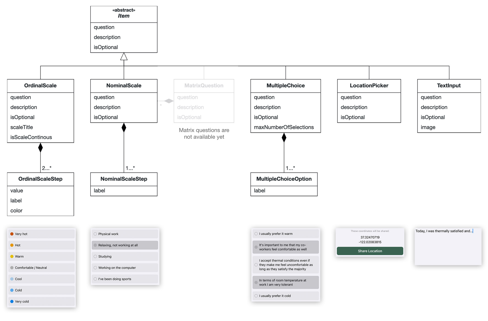

# COFFEE
COFFEE - Customizable Occupant-Friendly FEEdback applications. COFFEE is a lightweight, flexible and extensible SwiftUI framework to build customizable feedback applications for thermal comfort and IEQ research.

## How to use

Add this swift package to your Xcode project.
```
https://github.com/VictorPruefer/COFFEE
```

Import package, provide survey to display and completion handler to handle the submission after respondent completes survey.

```swift
import SwiftUI
import COFFEE

struct ContentView: View {
   
   // Specify the survey that you want to present
   let survey: Survey = {
       // Specify survey items, one item for each question
       let question1 = ...SurveyItem(...)
       
       // Create survey and add all items
       let survey = Survey(...)
       
       // Return survey
       return survey
    }()
   
    // Handle submission after the respondent completes survey
    func didCompleteSurvey(submission: Submission) {
       // Process submission
    }
    
    var body: some View {
        NavigationView {
            SurveyOverviewScreen(survey: survey, completionHandler: didCompleteSurvey(submission:))
        }
    }
}
```

## Item Types

COFFEE comes with a variety of different item types. An item type describes the input type and the UI component of a question. The following taxonomy shows the currently available item types.

<center>

</center>

Item Type | In Code | JSON type indentifier | Comment
--- | --- | --- | ---
Ordinal Scale | `OrdinalScaleSurveyItem` | `ordinalScale` | This item is supposed to be used for all questions that require a numeric scale such as the ASHRAE 7-point thermal sensation scale. Use `OrdinalScaleStep` to define the scale's steps.
Nominal Scale | `NominalScaleSurveyItem` | `nominalScale` | This item can be used whenever you have a set of options and you want to let the respondent choose one.
Multiple Choice | `MultipleChoiceSurveyItem` | `multipleChoice` | This item can be used to let the respondent pick multiple items from a set of options.
Location Picker | `LocationPickerSurveyItem` | `locationPicker` | This item requests the respondent's location. Note that if you wish to use this item, you need to add the `NSLocationWhenInUseUsageDescription` key to your projects `Info.plist` file.
Text Input | `TextInputSurveyItem` | `textInput` | This item lets the respondent enter any text.

## JSON En- and Decoding

You can either specify your survey by instanciating it in the code or by decoding it from a JSON file. Also, you can encode the resulting submission to JSON in order to e.g. upload it to a server. All model entities conform to the `Codable` protocol.

### Decode Survey from JSON

Prepare a JSON file that contains the survey that you wish to present. Example:
```json
...
```

Decode the JSON survey.
```swift
...
```

### Encode Submission to JSON

```swift
let jsonEncoder = JSONEncoder()
jsonEncoder.dateEncodingStrategy = .iso8601
jsonEncoder.outputFormatting = .prettyPrinted
let jsonResultData = try? jsonEncoder.encode(submission)
// Resulting json encoded submission
if let jsonResultData = jsonResultData {
    print(String(data: jsonResultData, encoding: .utf8) ?? "Invalid encodation")
}
```
